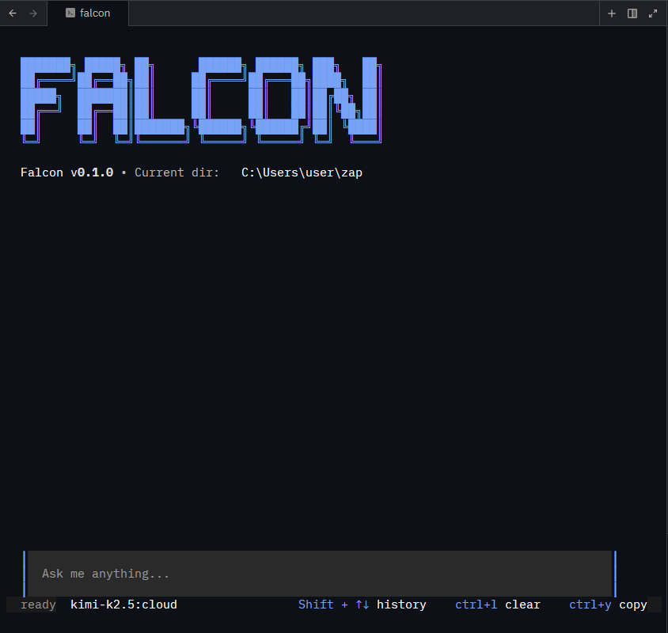

# Falcon ( formerly Zap)

> AI-powered API testing that understands your codebase

**Falcon** is a terminal-based AI assistant that doesn't just test your APIs — it debugs them. When an endpoint returns an error, Falcon searches your actual source code to find the cause and suggests fixes. Works with local LLMs (Ollama) or cloud providers (Gemini).



## Table of Contents

- [Installation](#installation)
- [Quick Start](#quick-start)
- [Features](#features)
- [Web Dashboard](#web-dashboard)
- [Architecture](#architecture)
- [Configuration](#configuration)
- [Usage](#usage)
- [Available Tools](#available-tools)
- [Contributing](#contributing)
- [License](#license)

---

## Installation

### Manual Installation

Download the latest pre-built binary for your operating system from [Releases](https://github.com/blackcoderx/falcon/releases).

**Windows:**
1. Download `falcon_Windows_x86_64.zip`.
2. Extract the archive.
3. Add the extracted folder to your system `PATH`.

**macOS/Linux:**
1. Download the `tar.gz` archive for your architecture.
2. Extract the archive: `tar -xzf falcon_...tar.gz`
3. Move the binary to a location in your `PATH` (e.g., `/usr/local/bin`).

### From Source

```bash
go install github.com/blackcoderx/falcon/cmd/falcon@latest
```

## Updating

Falcon includes a self-update command to easily upgrade to the latest version:

```bash
falcon update
```

This checks for the latest release on GitHub and updates your binary in place (requires write permissions to the binary location).

---

## Quick Start

### Prerequisites

- Go 1.25.3 or higher
- [Ollama](https://ollama.ai/) for local AI (or a Gemini API key for cloud)

### Build and Run

```bash
git clone https://github.com/blackcoderx/falcon.git
cd falcon
go build -o falcon.exe ./cmd/falcon
./falcon

```

### First Run

1. Falcon creates a `.falcon/` folder with config, history, and memory
2. Select your LLM provider (Ollama local, Ollama cloud, or Gemini)
3. Choose your API framework (gin, fastapi, express, etc.)
4. The web dashboard starts on a random localhost port — URL printed to terminal
5. The interactive TUI launches with the Falcon ASCII splash screen showing version, working directory, and web UI URL

---

## Features

### Codebase-Aware Debugging

Falcon doesn't just show you errors — it explains them:

- **Stack trace parsing** — Extracts file:line from Python, Go, and JavaScript tracebacks
- **Autonomous testing** — One-click `auto_test` workflow: Analyze → Generate → Execute → Diagnose
- **Intelligent fixes** — Full unified diffs with `propose_fix` (not just suggestions)
- **Regression testing** — Auto-generate test files so bugs stay fixed
- **Framework patterns** — Detects endpoint handlers across 15+ frameworks using framework-specific idioms

### 28 Specialized Tools

Falcon's toolkit is precisely curated to support 8 API testing types:
- **Unit**: Test individual endpoints with assertions
- **Integration**: Chain endpoints into multi-step workflows
- **Smoke**: Fast health checks across all endpoints
- **Functional**: Comprehensive happy-path, negative, and edge-case testing
- **Contract**: Verify API spec compliance and prevent regressions
- **Performance**: Load testing, stress testing, soak testing
- **Security**: OWASP vulnerability scanning and auth bypass detection
- **E2E**: End-to-end user journeys across services

Tools are organized by domain via a central `Registry`. See [Available Tools](#available-tools) for the complete list.

### Beautiful Terminal Interface

Built with the [Charm](https://charm.sh/) ecosystem:

- **Falcon ASCII splash screen** — Branded intro showing version, working directory, and web UI URL
- **Streaming responses** — Text appears as the LLM generates it (real-time token streaming)
- **Markdown rendering** — Responses are beautifully formatted with Glamour syntax highlighting
- **Input history** — Navigate previous commands with Shift+Up/Down
- **Clipboard support** — Copy last response with Ctrl+Y
- **Status line** — Live status (thinking, executing tool, streaming, idle)
- **Harmonica spring animations** — Smooth pulsing animation during thinking
- **Companion web dashboard** — Automatically opens alongside the TUI at a random localhost port

### Human-in-the-Loop Safety

When Falcon wants to modify a file:

1. Shows a colored unified diff of the proposed changes
2. Waits for your approval (Y/N) — with scrollable diff view
3. Only writes the file if you confirm

No surprises, no unauthorized changes.

### Persistent Memory

Falcon maintains a `MemoryStore` across sessions stored in `.falcon/memory.json`. The agent tracks conversation turns, tool usage patterns, and key facts to provide more contextual assistance over time.

---

## Web Dashboard

When you start Falcon, a companion web dashboard spins up automatically alongside the TUI:

```
Falcon Web UI -> http://localhost:54821
```

The port is random by default (OS-assigned) and is also shown in the TUI splash screen:

```
Falcon v1.0.0 • Current dir: /your/project • Web UI: http://localhost:54821
```

The dashboard is a read/write interface over your `.falcon` workspace — no separate server to run, no build step, embedded directly in the binary.

### Dashboard Sections

| Section | Access | Description |
|---------|--------|-------------|
| **Dashboard** | Read | Workspace stats (request count, environments, baselines) and active config summary |
| **Config** | Read/Write | Edit LLM provider, model, API keys, framework, and per-tool limits |
| **Requests** | Read/Write | Browse, create, edit, and delete saved API requests with inline body/header editor |
| **Environments** | Read/Write | Manage environment variable files (dev, prod, staging, etc.) with key-value editor |
| **Memory** | Read/Write | View and edit persistent agent memory entries, grouped by category |
| **Variables** | Read/Write | Manage global variables used in `{{VAR}}` substitution |
| **History** | Read | Session timeline — start time, duration, tools used, turn count |
| **API Graph** | Read | Collapsible endpoint explorer from ingested OpenAPI/Postman specs, with security risk badges |
| **Exports** | Read | Browse and view test result exports (JSON/Markdown reports) |

### Web UI Configuration

Control the web dashboard via `config.yaml`:

```yaml
web_ui:
  enabled: true
  port: 0
```

| Field | Default | Description |
|-------|---------|-------------|
| `enabled` | `true` | Set to `false` to disable the web dashboard |
| `port` | `0` | Fixed port to bind to. `0` = OS-assigned random port |

The web server only binds to `127.0.0.1` (localhost) — it is never exposed to the network.

---

## Architecture

```
falcon/
├── cmd/falcon/               # Application entry point (Cobra CLI)
│   ├── main.go               # Root command, CLI flags, runCLI() for CLI mode
│   └── update.go             # Self-update command via go-github-selfupdate
├── pkg/
│   ├── core/                 # Agent logic, ReAct loop, initialization
│   │   ├── agent.go          # Agent struct: tool registry, limits, history mgmt
│   │   ├── react.go          # ReAct loop: ProcessMessage / ProcessMessageWithEvents
│   │   ├── init.go           # .falcon folder setup, setup wizard, config migration
│   │   ├── memory.go         # MemoryStore: persistent agent memory (memory.json)
│   │   ├── analysis.go       # Stack trace parsing, error context extraction
│   │   ├── prompt/           # System prompt builder (20-section LLM instructions)
│   │   ├── types.go          # Core interfaces: Tool, AgentEvent, ConfirmableTool
│   │   └── tools/            # 40+ tools organized in 19 packages
│   │       ├── registry.go   # Central tool registry (RegisterAllTools)
│   │       ├── shared/       # Tier 1: HTTP, Auth, Assert, Validate, Webhooks
│   │       ├── debugging/    # Tier 2: Read/Write file, Search, Fix, Analyze
│   │       ├── persistence/  # Tier 2: Variables, Requests, Environments
│   │       ├── agent/        # Tier 2: Memory, Export, RunTests, AutoTest
│   │       ├── spec_ingester/            # Tier 3: OpenAPI/Swagger → Knowledge Graph
│   │       ├── functional_test_generator/ # Generate + run functional test suites
│   │       ├── security_scanner/         # OWASP-style security scanning
│   │       ├── performance_engine/       # Multi-mode load testing (burst, ramp, soak)
│   │       ├── smoke_runner/             # Quick smoke test suite
│   │       ├── idempotency_verifier/     # Verify PUT/POST idempotency
│   │       ├── data_driven_engine/       # Data-driven test execution
│   │       ├── schema_conformance/       # Schema conformance checks
│   │       ├── breaking_change_detector/ # Breaking change detection
│   │       ├── dependency_mapper/        # API dependency graph mapping
│   │       ├── documentation_validator/  # API doc accuracy validation
│   │       ├── api_drift_analyzer/       # Detect runtime drift from spec
│   │       ├── integration_orchestrator/ # Multi-service integration flows
│   │       ├── regression_watchdog/      # Automated regression detection
│   │       └── unit_test_scaffolder/     # LLM-powered unit test generation
│   ├── llm/                  # LLM provider clients
│   │   ├── client.go         # LLMClient interface
│   │   ├── ollama.go         # Ollama client (local & cloud, streaming)
│   │   └── gemini.go         # Google Gemini client (streaming)
│   ├── storage/              # Low-level I/O layer
│   │   ├── yaml.go           # YAML read/write for requests & environments
│   │   ├── env.go            # .env file loading, variable substitution
│   │   └── schema.go         # JSON Schema helpers
│   ├── web/                  # Embedded web dashboard
│   │   ├── server.go         # Start(): port binding, embed, CORS, graceful shutdown
│   │   ├── routes.go         # All REST API routes on net/http ServeMux
│   │   ├── handlers.go       # HTTP handlers + path traversal protection
│   │   ├── readers.go        # Disk read helpers (wraps storage.*)
│   │   ├── writers.go        # Atomic disk writes (temp + rename)
│   │   └── static/           # Embedded frontend (served from binary)
│   │       ├── index.html    # Shell markup
│   │       ├── style.css     # Japanese minimal dark theme (charcoal + Falcon blue)
│   │       └── app.js        # Vanilla JS router, API client, section renderers
│   └── tui/                  # Terminal UI (Bubble Tea)
│       ├── app.go            # tui.Run() entry point
│       ├── init.go           # InitialModel, tool registration, LLM client setup
│       ├── model.go          # Model struct, state definition
│       ├── update.go         # Bubble Tea Update() — event → state transitions
│       ├── view.go           # Bubble Tea View() — state → rendered string
│       ├── keys.go           # Key bindings, input handling, history navigation
│       ├── styles.go         # Lip Gloss style definitions, color palette
│       └── highlight.go      # Syntax highlighting helpers
├── .falcon/                     # User config & runtime data (created on first run)
└── go.mod                    # Go module (go 1.25.3)
```

### Core Components

| Component | Location | Purpose |
|-----------|----------|---------|
| **Agent** | `pkg/core/agent.go` | Tool registry, per-tool & total call limits, history management |
| **ReAct Loop** | `pkg/core/react.go` | Reason-Act-Observe cycle; streaming via `ProcessMessageWithEvents` |
| **System Prompt** | `pkg/core/prompt/` | 20-section LLM instructions with tool schemas |
| **Tool Registry** | `pkg/core/tools/registry.go` | Centralized registration of all 40+ tools |
| **LLM Clients** | `pkg/llm/` | Ollama (local/cloud) and Gemini with streaming support |
| **TUI** | `pkg/tui/` | Bubble Tea UI with harmonica spring animations |
| **Web Dashboard** | `pkg/web/` | Embedded localhost web UI — read/write over `.falcon` workspace |
| **Storage** | `pkg/storage/` | YAML I/O, variable substitution, .env loading |
| **Memory Store** | `pkg/core/memory.go` | Persistent memory in `.falcon/memory.json` |

### Message Flow

```
User Input → TUI keys.go
           → runAgentAsync() goroutine
           → Agent.ProcessMessageWithEvents(ctx, input, callback)
           → LLM ChatStream() → streaming chunks → "streaming" events → TUI
           → parseResponse() → toolName + toolArgs extracted (ReAct format)
           → executeTool() → tool.Execute(args)
               → "tool_call" event → TUI status update
               → "observation" event → appended to history
               → "tool_usage" event → per-tool counter displayed
           → Loop or Final Answer
           → "answer" event → TUI renders markdown response
```

### ReAct Response Format

The LLM follows this structured format:
```
Thought: <reasoning about what to do next>
ACTION: tool_name({"arg": "value"})
```
or
```
Final Answer: <response to user>
```

The parser handles LLM formatting variations, including missing `ACTION:` prefixes and raw `tool_name(...)` calls.

See [pkg/core/README.md](pkg/core/README.md) for detailed architecture documentation.

---

## Configuration

### Setup Wizard

On first run, Falcon walks you through a guided Huh-powered wizard:

```bash
./falcon

# Step 1: Select your API framework
#   gin (Go), echo (Go), chi (Go), fiber (Go)
#   fastapi (Python), flask (Python), django (Python)
#   express (Node.js), nestjs (Node.js), hono (Node.js)
#   spring (Java), laravel (PHP), rails (Ruby)
#   actix (Rust), axum (Rust), other

# Step 2: Select LLM provider
#   Ollama (local or cloud)
#   Gemini (Google AI)

# Step 3: Provider-specific config (URL, model, API key)

# Step 4: Confirm and create .falcon/config.yaml
```

### CLI Flags

```bash
falcon                                  # Launch interactive TUI
falcon --framework gin                  # Skip framework selection in wizard
falcon --request get-users --env prod   # CLI mode: run saved request
falcon -r get-users -e dev              # Short form
falcon --no-index                       # Skip automatic API spec indexing
falcon --help                           # Show all flags
falcon version                          # Print version, commit, build date
falcon update                           # Self-update to latest release
```


### config.yaml Schema

```yaml
provider: ollama
ollama:
  mode: local           # "local" or "cloud"
  url: http://localhost:11434
  api_key: ""
gemini:
  api_key: ""
default_model: llama3
framework: gin
theme: dark
tool_limits:
  default_limit: 50
  total_limit: 200
  per_tool:
    http_request: 25
    performance_test: 5
    auto_test: 5
    read_file: 50
    search_code: 30
    variable: 100
web_ui:
  enabled: true
  port: 0
```

**Supported providers:** `ollama` (local or cloud) · `gemini`

**Optional `.env` file** at project root:
```env
OLLAMA_API_KEY=your_key_here
GEMINI_API_KEY=your_key_here
```

### Saved Requests

```yaml
# .falcon/requests/get-users.yaml
name: Get Users
method: GET
url: "{{BASE_URL}}/api/users"
headers:
  Authorization: "Bearer {{API_TOKEN}}"
```

### Environments

```yaml
# .falcon/environments/dev.yaml
BASE_URL: http://localhost:3000
API_KEY: your-dev-api-key
```

### Tool Limits

Prevent runaway execution with per-tool and global limits:

| Setting | Default | Description |
|---------|---------|-------------|
| `default_limit` | 50 | Fallback for tools without a specific limit |
| `total_limit` | 200 | Safety cap on total calls per session |
| `per_tool` | varies | Per-tool overrides (see `pkg/core/init.go:DefaultToolLimits`) |

---

## Usage

### Interactive Mode

```bash
./falcon
```

#### Keyboard Shortcuts

| Key | Action |
|-----|--------|
| `Enter` | Send message |
| `Shift+↑/↓` | Navigate input history |
| `PgUp/PgDown` | Scroll output |
| `Ctrl+L` | Clear screen |
| `Ctrl+U` | Clear input line |
| `Ctrl+Y` | Copy last response to clipboard |
| `Esc` | Stop agent (running) / Quit (idle) |
| `Ctrl+C` | Quit |

#### File Write Confirmation

When Falcon wants to modify a file, it enters confirmation mode:

| Key | Action |
|-----|--------|
| `Y` | Approve change and write file |
| `N` | Reject change |
| `PgUp/PgDown` | Scroll diff view |
| `Esc` | Reject and continue |

### CLI Mode (Automation / CI/CD)

```bash
# Execute saved request with environment variable substitution
./falcon --request get-users --env prod

# Combine with framework setup
./falcon --framework gin --request health-check --env staging
```

---

## Available Tools

All 28 tools are registered via `pkg/core/tools/registry.go` and organized by testing type and domain.

### Core Tools (5)

Essential for every interaction:

| Tool | Description |
|------|-------------|
| `http_request` | Make HTTP requests with status code hints and variable substitution |
| `variable` | Get/set session-scoped (temp) or global-scoped (persistent) variables |
| `auth` | Unified authentication — bearer, basic, OAuth2, JWT parsing (merged 4 tools) |
| `wait` | Add delays for async operations, polling, backoff |
| `retry` | Retry failed tool calls with exponential backoff |

### Persistence Tools (6)

Manage requests, environments, and .falcon artifacts:

| Tool | Description |
|------|-------------|
| `request` | Save/load/list API requests with `{{VAR}}` placeholders (merged 3 tools) |
| `environment` | Set/list environment variables (dev, prod, staging) (merged 2 tools) |
| `falcon_write` | Write validated YAML/JSON/Markdown to .falcon/ with path safety |
| `falcon_read` | Read artifacts from .falcon/ (reports, flows, specs) |
| `memory` | Recall/save/update API knowledge base across sessions |
| `session_log` | Create session audit trail — start/end, summary, searchable history |

### Testing Tools by Type

#### Unit (3 tools) — Test individual endpoints
| Tool | Description |
|------|-------------|
| `assert_response` | Validate status codes, headers, body content, JSON paths |
| `extract_value` | Extract values via JSON path, headers, cookies, regex for chaining |
| `validate_json_schema` | Strict validation against JSON Schema (draft-07, draft-2020-12) |

#### Integration (1 tool) — Multi-step workflows
| Tool | Description |
|------|-------------|
| `orchestrate_integration` | Chain multiple requests in a single transaction with resource linking |

#### Smoke (1 tool) — Fast health checks
| Tool | Description |
|------|-------------|
| `run_smoke` | Hit all endpoints once to verify API is up |

#### Functional (3 tools) — Happy path, negative, edge cases
| Tool | Description |
|------|-------------|
| `generate_functional_tests` | LLM-driven test generation with strategies (Happy/Negative/Boundary) |
| `run_tests` | Execute test scenarios in parallel; optional `scenario` param for single test |
| `run_data_driven` | Bulk testing with CSV/JSON data sources |

#### Contract (3 tools) — Spec compliance & regression
| Tool | Description |
|------|-------------|
| `verify_idempotency` | Confirm requests have no side effects (safe to retry) |
| `compare_responses` | Compare two responses for differences (regression testing) |
| `check_regression` | Compare against baseline snapshots from `.falcon/baselines/` |

#### Performance (2 tools) — Load & resilience testing
| Tool | Description |
|------|-------------|
| `run_performance` | Load/stress/spike/soak testing with latency metrics (p50/p95/p99) |
| `webhook_listener` | Temporary HTTP server to capture webhook callbacks during async tests |

#### Security (1 tool) — OWASP & auth auditing
| Tool | Description |
|------|-------------|
| `scan_security` | OWASP vulnerability scanning, input fuzzing, auth bypass detection |

### Debugging Tools (7)

Root cause analysis and code fixes:

| Tool | Description |
|------|-------------|
| `find_handler` | Framework-aware discovery of endpoint source code handlers |
| `analyze_endpoint` | LLM-powered deep analysis of endpoint structure and security risks |
| `analyze_failure` | Expert LLM assessment of why a test failed, with remediation steps |
| `propose_fix` | Generate unified diffs to fix identified bugs or vulnerabilities |
| `read_file` | Read file contents (100KB security limit) |
| `search_code` | Search patterns with ripgrep (native Go fallback) |
| `write_file` | Write files with human-in-the-loop confirmation and diff view |

### Orchestration Tools (2)

Advanced multi-test management:

| Tool | Description |
|------|-------------|
| `auto_test` | Autonomous workflow: ingest spec → generate tests → run → fix failures |
| `test_suite` | Bundle multiple flows into a named, reusable suite |

### Spec Ingestion (1)

| Tool | Description |
|------|-------------|
| `ingest_spec` | Transform OpenAPI/Swagger or Postman specs into `.falcon/spec.yaml` (YAML) |

---

---

## .falcon Folder Structure

Falcon creates a persistent `.falcon/` folder on first run:

```
.falcon/
├── config.yaml              # LLM provider, model, framework, tool limits
├── memory.json              # Persistent agent memory
├── falcon.md                # API knowledge base (validated on write)
├── spec.yaml                # Ingested API spec (YAML, human-readable)
├── variables.json           # Global variables
├── sessions/                # Session audit logs
├── environments/            # Environment files (dev.yaml, prod.yaml, etc.)
├── requests/                # Saved API requests
├── baselines/               # Regression testing baselines
├── flows/                   # Multi-step test flows (flat, type-prefixed)
└── reports/                 # Test reports (flat, type-prefixed)
```

**Key improvements:**
- **Flat structure**: No subdirectories in `reports/` or `flows/` — filenames carry type context
- **YAML spec**: `spec.yaml` is human-readable (not JSON)
- **Validated artifacts**: Reports and falcon.md are validated on write to catch empty/incomplete content
- **Session audit trail**: Each conversation logs to `.falcon/sessions/session_<timestamp>.json`
- **Flat naming conventions**:
  - Reports: `<type>_report_<api-name>_<timestamp>.md` (e.g., `performance_report_users_api_20260227.md`)
  - Flows: `<type>_<description>.yaml` (e.g., `integration_login_create_delete.yaml`)

---

## Contributing

Contributions are welcome! See the package-level documentation for understanding the codebase:

- [pkg/core/README.md](pkg/core/README.md) — Agent, ReAct loop, and tool interface
- [pkg/core/tools/README.md](pkg/core/tools/README.md) — Tool implementation guide
- [pkg/llm/README.md](pkg/llm/README.md) — Adding new LLM providers
- [pkg/storage/README.md](pkg/storage/README.md) — Persistence layer
- [pkg/tui/README.md](pkg/tui/README.md) — Terminal UI
- [CONTRIBUTING.md](CONTRIBUTING.md) — Contribution guidelines

### Adding a New Tool

1. Create a new `.go` file in the appropriate package under `pkg/core/tools/`
2. Implement the `core.Tool` interface:

```go
type Tool interface {
    Name() string
    Description() string
    Parameters() string  // JSON Schema string
    Execute(args string) (string, error)
}
```

3. Register it in the relevant `register*` method in `pkg/core/tools/registry.go`

For tools requiring human approval (e.g., file writes), implement `core.ConfirmableTool` to get a `SetEventCallback` hook.

---

## Tech Stack

| Component | Technology |
|-----------|------------|
| Language | Go 1.25.3 |
| CLI Framework | Cobra + Viper |
| TUI | Bubble Tea · Lip Gloss · Bubbles · Glamour · Huh · Harmonica |
| LLM Providers | Ollama (local/cloud) · Google Gemini (`google.golang.org/genai`) |
| OpenAPI Parsing | `pb33f/libopenapi` |
| Postman Parsing | `rbretecher/go-postman-collection` |
| OAuth2 | `golang.org/x/oauth2` |
| Self-Update | `rhysd/go-github-selfupdate` |
| Code Search | ripgrep (with native Go fallback) |
| Diff Generation | `aymanbagabas/go-udiff` |
| JSON Schema | `xeipuuv/gojsonschema` |
| Data Format | YAML (config/requests/environments) · JSON (memory/manifest) |

---

## License

MIT

## Acknowledgments

Built with the amazing [Charm](https://charm.sh/) ecosystem.
