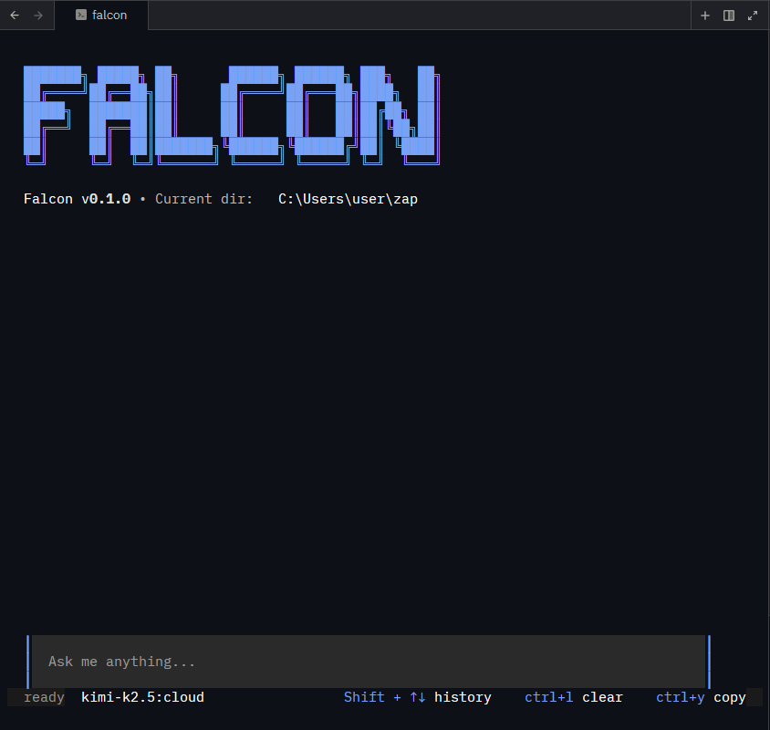

# Falcon

**Falcon** is a terminal-based AI agent built for API developers who are tired of switching between their terminal, browser, and code editor just to debug a failing endpoint. You describe what you want to test — Falcon handles the rest. It doesn't just test your APIs, it debugs them. When an endpoint returns an error, Falcon searches your actual source code to find the cause and suggests fixes.



## Table of Contents

- [Installation](#installation)
- [Quick Start](#quick-start)
- [Features](#features)
- [Web Dashboard](#web-dashboard)
- [Architecture](#architecture)
- [Configuration](#configuration)
- [Usage](#usage)
- [Available Tools](#available-tools)
- [Contributing](#contributing)
- [License](#license)

---

## Installation

### Manual Installation

Download the latest pre-built binary for your operating system from [Releases](https://github.com/blackcoderx/falcon/releases).

**Windows:**
1. Download `falcon_Windows_x86_64.zip`.
2. Extract the archive.
3. Add the extracted folder to your system `PATH`.

**macOS/Linux:**
1. Download the `tar.gz` archive for your architecture.
2. Extract: `tar -xzf falcon_...tar.gz`
3. Move to your `PATH`: `mv falcon /usr/local/bin/`

### From Source

```bash
go install github.com/blackcoderx/falcon/cmd/falcon@latest
```

## Updating

Falcon includes a self-update command:

```bash
falcon update
```

Checks for the latest release on GitHub and updates your binary in place (requires write permissions to the binary location).

---

## Quick Start

### Prerequisites

- Go 1.21 or higher (to build from source)
- One of:
  - [Ollama](https://ollama.ai/) for local AI
  - A Gemini API key (Google AI)
  - An OpenRouter API key

### Build and Run

```bash
git clone https://github.com/blackcoderx/falcon.git
cd falcon
go build -o falcon.exe ./cmd/falcon   # Windows
go build -o falcon ./cmd/falcon       # Unix
./falcon
```

### First Run

1. Falcon creates a `~/.falcon/` global folder for credentials and a `.falcon/` project folder for requests, environments, and memory.
2. A guided wizard walks you through selecting your LLM provider and entering credentials (stored globally in `~/.falcon/config.yaml`).
3. Select your API framework (gin, fastapi, express, etc.).
4. The web dashboard starts on `localhost` — URL is printed to the terminal.
5. The interactive TUI launches with the Falcon splash screen showing your version, working directory, and web UI URL.

---

## Features

### Codebase-Aware Debugging

Falcon doesn't just show you errors — it explains them:

- **Stack trace parsing** — Extracts `file:line` from Python, Go, and JavaScript tracebacks
- **Autonomous testing** — One-click `auto_tester` workflow: Analyze → Generate → Execute → Diagnose
- **Intelligent fixes** — Full unified diffs with `propose_fix` (not just suggestions)
- **Regression testing** — Auto-generate test files so bugs stay fixed
- **Framework patterns** — `find_handler` uses framework-specific search patterns for Gin, Echo, FastAPI, and Express; falls back to a generic path search for other frameworks

### 28+ Specialized Tools

Falcon's toolkit supports 8 API testing types:

- **Unit** — Test individual endpoints with assertions
- **Integration** — Chain endpoints into multi-step workflows
- **Smoke** — Fast health checks across all endpoints
- **Functional** — Comprehensive happy-path, negative, and edge-case testing
- **Contract** — Verify API spec compliance and prevent regressions
- **Performance** — Load testing, stress testing, soak testing
- **Security** — OWASP vulnerability scanning and auth bypass detection
- **E2E** — End-to-end user journeys across services

Tools are organized by domain via a central `Registry`. See [Available Tools](#available-tools) for the complete list.

### Beautiful Terminal Interface

Built with the [Charm](https://charm.sh/) ecosystem:

- **Falcon ASCII splash screen** — Branded intro showing version, working directory, and web UI URL
- **Streaming responses** — Text appears as the LLM generates it (real-time token streaming)
- **Markdown rendering** — Responses are beautifully formatted with Glamour syntax highlighting
- **Input history** — Navigate previous commands with Shift+Up/Down
- **Clipboard support** — Copy last response with Ctrl+Y
- **Status line** — Live status (thinking, executing tool, streaming, idle)
- **Tool usage badges** — Per-tool call counts shown inline
- **Model picker** — Switch LLM models mid-session with `/model`
- **Environment picker** — Switch environments mid-session with `/env`
- **Harmonica spring animations** — Smooth pulsing animation during thinking
- **Companion web dashboard** — Automatically opens alongside the TUI

### Human-in-the-Loop Safety

When Falcon wants to modify a file:

1. Shows a colored unified diff of the proposed changes
2. Waits for your approval (Y/N) — with scrollable diff view
3. Only writes the file if you confirm

No surprises, no unauthorized changes.

### Pluggable LLM Providers

Falcon uses a self-registering provider system. Out of the box:

| Provider | Description |
|----------|-------------|
| **Ollama** | Local or cloud-hosted Ollama (default model: `llama3`) |
| **Gemini** | Google Gemini API (default model: `gemini-2.5-flash-lite`) |
| **OpenRouter** | Multi-model gateway — Claude, GPT-4, Llama, and more (default: `google/gemini-2.5-flash-lite`) |

### Persistent Memory

Falcon maintains a `MemoryStore` across sessions stored in `~/.falcon/memory.json`. The agent tracks conversation turns, tool usage patterns, and key facts to provide more contextual assistance over time.

---

## Web Dashboard

When you start Falcon, a companion web dashboard spins up automatically alongside the TUI:

```
Falcon Web UI -> http://localhost:54821
```

The port is random by default (OS-assigned) and is also shown in the TUI splash screen. The dashboard is a read/write interface over your `.falcon` workspace — no separate server to run, no build step, embedded directly in the binary.

### Dashboard Sections

| Section | Access | Description |
|---------|--------|-------------|
| **Dashboard** | Read | Workspace stats (request count, environments, baselines) and active config summary |
| **Config** | Read/Write | Edit LLM provider, model, API keys, framework, and per-tool limits |
| **Requests** | Read/Write | Browse, create, edit, and delete saved API requests with inline body/header editor |
| **Environments** | Read/Write | Manage environment variable files (dev, prod, staging, etc.) with key-value editor |
| **Memory** | Read/Write | View and edit persistent agent memory entries, grouped by category |
| **Variables** | Read/Write | Manage global variables used in `{{VAR}}` substitution |
| **History** | Read | Session timeline — start time, duration, tools used, turn count |
| **API Graph** | Read | Collapsible endpoint explorer from ingested OpenAPI/Postman specs, with security risk badges |
| **Exports** | Read | Browse and view test result exports (JSON/Markdown reports) |

### Web UI Configuration

Control the web dashboard via `.falcon/config.yaml`:

```yaml
web_ui:
  enabled: true
  port: 0
```

| Field | Default | Description |
|-------|---------|-------------|
| `enabled` | `true` | Set to `false` to disable the web dashboard |
| `port` | `0` | Fixed port to bind to. `0` = OS-assigned random port |

The web server only binds to `127.0.0.1` (localhost) — it is never exposed to the network.

---

## Architecture

```
falcon/
├── cmd/falcon/               # Application entry point (Cobra CLI)
│   ├── main.go               # Root command, CLI flags, runCLI() for CLI mode
│   └── update.go             # Self-update command via go-github-selfupdate
├── pkg/
│   ├── core/                 # Agent logic, ReAct loop, initialization
│   │   ├── agent.go          # Agent struct: tool registry, limits, history mgmt
│   │   ├── react.go          # ReAct loop: ProcessMessage / ProcessMessageWithEvents
│   │   ├── init.go           # .falcon folder setup, setup wizard, config migration
│   │   ├── globalconfig.go   # Global ~/.falcon/config.yaml management
│   │   ├── memory.go         # MemoryStore: persistent agent memory (memory.json)
│   │   ├── analysis.go       # Stack trace parsing, error context extraction
│   │   ├── prompt/           # System prompt builder (multi-section LLM instructions)
│   │   ├── types.go          # Core interfaces: Tool, AgentEvent, ConfirmableTool
│   │   └── tools/            # 28+ tools organized in 13 packages
│   │       ├── registry.go   # Central tool registry (RegisterAllTools)
│   │       ├── shared/       # Tier 1: HTTP, Auth, Assert, Extract, Validate, Webhooks
│   │       ├── debugging/    # Tier 2: Read/Write file, Search, Fix, Analyze
│   │       ├── persistence/  # Tier 2: Variables, Requests, Environments
│   │       ├── agent/        # Tier 2: Memory, Export, RunTests, AutoTest
│   │       ├── spec_ingester/             # Tier 3: OpenAPI/Swagger/Postman → Knowledge Graph
│   │       ├── functional_test_generator/ # Generate + run functional test suites
│   │       ├── security_scanner/          # OWASP-style security scanning
│   │       ├── performance_engine/        # Multi-mode load testing (burst, ramp, soak)
│   │       ├── smoke_runner/              # Quick smoke test suite
│   │       ├── idempotency_verifier/      # Verify PUT/POST idempotency
│   │       ├── data_driven_engine/        # Data-driven test execution
│   │       ├── regression_watchdog/       # Regression detection against baselines
│   │       └── integration_orchestrator/  # Multi-endpoint integration flows
│   ├── llm/                  # Pluggable LLM provider system
│   │   ├── client.go         # LLMClient interface (Chat, ChatStream, CheckConnection)
│   │   ├── provider.go       # Provider interface + SetupField types
│   │   ├── registry.go       # Global provider registry (Register, Get, All)
│   │   ├── register_providers.go  # Blank imports to activate providers
│   │   ├── ollama/           # Ollama client + provider registration
│   │   ├── gemini/           # Google Gemini client + provider registration
│   │   └── openrouter/       # OpenRouter client + provider registration
│   ├── storage/              # Low-level I/O layer
│   │   ├── yaml.go           # YAML read/write for requests & environments
│   │   ├── env.go            # .env file loading, variable substitution
│   │   └── schema.go         # Core data structures (Request, Environment, Collection)
│   ├── web/                  # Embedded web dashboard
│   │   ├── server.go         # Start(): port binding, embed, CORS, graceful shutdown
│   │   ├── routes.go         # All REST API routes on net/http ServeMux
│   │   ├── handlers.go       # HTTP handlers + path traversal protection
│   │   ├── readers.go        # Disk read helpers (wraps storage.*)
│   │   ├── writers.go        # Atomic disk writes (temp + rename)
│   │   └── static/           # Embedded frontend (served from binary)
│   │       ├── index.html    # Shell markup
│   │       ├── style.css     # Japanese minimal dark theme (charcoal + Falcon blue)
│   │       └── app.js        # Vanilla JS router, API client, section renderers
│   └── tui/                  # Terminal UI (Bubble Tea)
│       ├── app.go            # tui.Run() entry point
│       ├── init.go           # InitialModel, tool registration, LLM client setup
│       ├── model.go          # Model struct, state definition
│       ├── update.go         # Bubble Tea Update() — event → state transitions
│       ├── view.go           # Bubble Tea View() — state → rendered string
│       ├── keys.go           # Key bindings, input handling, history navigation
│       ├── modelpicker.go    # In-session model switcher UI
│       ├── envpicker.go      # In-session environment switcher UI
│       ├── slash.go          # Slash command processor
│       ├── styles.go         # Lip Gloss style definitions, color palette
│       └── highlight.go      # Syntax highlighting helpers
├── .falcon/                  # Project config & runtime data (created on first run)
└── go.mod                    # Go module
```

### Core Components

| Component | Location | Purpose |
|-----------|----------|---------|
| **Agent** | `pkg/core/agent.go` | Tool registry, per-tool & total call limits, history management |
| **ReAct Loop** | `pkg/core/react.go` | Reason-Act-Observe cycle; streaming via `ProcessMessageWithEvents` |
| **System Prompt** | `pkg/core/prompt/` | Multi-section LLM instructions with tool schemas |
| **Tool Registry** | `pkg/core/tools/registry.go` | Centralized registration of all 28+ tools |
| **LLM Registry** | `pkg/llm/registry.go` | Self-registering provider system |
| **TUI** | `pkg/tui/` | Bubble Tea UI with harmonica spring animations |
| **Web Dashboard** | `pkg/web/` | Embedded localhost web UI — read/write over `.falcon` workspace |
| **Storage** | `pkg/storage/` | YAML I/O, variable substitution, .env loading |
| **Memory Store** | `pkg/core/memory.go` | Persistent memory in `~/.falcon/memory.json` |

### Message Flow

```
User Input → TUI keys.go
           → runAgentAsync() goroutine
           → Agent.ProcessMessageWithEvents(ctx, input, callback)
           → LLM ChatStream() → streaming chunks → "streaming" events → TUI
           → parseResponse() → toolName + toolArgs extracted (ReAct format)
           → executeTool() → tool.Execute(args)
               → "tool_call" event → TUI status update
               → "observation" event → appended to history
               → "tool_usage" event → per-tool counter displayed
           → Loop or Final Answer
           → "answer" event → TUI renders markdown response
```

### ReAct Response Format

The LLM follows this structured format:
```
Thought: <reasoning about what to do next>
ACTION: tool_name({"arg": "value"})
```
or
```
Final Answer: <response to user>
```

The parser handles LLM formatting variations, including missing `ACTION:` prefixes and raw `tool_name(...)` calls.

---

## Configuration

### Setup Wizard

On first run, Falcon walks you through a guided Huh-powered wizard:

```bash
./falcon

# Step 1: Select your API framework
#   gin (Go), echo (Go), chi (Go), fiber (Go)
#   fastapi (Python), flask (Python), django (Python)
#   express (Node.js), nestjs (Node.js), hono (Node.js)
#   spring (Java), laravel (PHP), rails (Ruby)
#   actix (Rust), axum (Rust), other

# Step 2: Select LLM provider
#   Ollama (local or cloud)
#   Gemini (Google AI)
#   OpenRouter (multi-model gateway)

# Step 3: Provider-specific config (URL, model, API key)
# Credentials saved globally to ~/.falcon/config.yaml
```

Run `falcon config` at any time to reconfigure your LLM provider and credentials.

### CLI Flags

```bash
falcon                                  # Launch interactive TUI
falcon config                           # Open global provider/model config wizard
falcon version                          # Print version, commit, build date
falcon update                           # Self-update to latest release
falcon --framework gin                  # Skip framework selection in wizard
falcon --request get-users --env prod   # CLI mode: run saved request
falcon -r get-users -e dev              # Short form
falcon --no-index                       # Skip automatic API spec indexing
falcon --help                           # Show all flags
```

### Configuration Files

Falcon uses two config files:

**Global config** (`~/.falcon/config.yaml`) — LLM provider credentials, shared across all projects:

```yaml
default_provider: ollama
theme: dark
web_ui:
  enabled: true
  port: 0
providers:
  ollama:
    model: llama3
    config:
      mode: local
      url: http://localhost:11434
      api_key: ""
  gemini:
    model: gemini-2.5-flash-lite
    config:
      api_key: ""
  openrouter:
    model: google/gemini-2.5-flash-lite
    config:
      api_key: ""
```

**Project config** (`.falcon/config.yaml`) — Per-project overrides:

```yaml
provider: ""             # Override global provider for this project
default_model: ""        # Override model for this project
framework: gin
theme: dark
tool_limits:
  default_limit: 50
  total_limit: 200
  per_tool:
    http: 25
    performance_test: 5
    auto_tester: 5
    read_file: 50
    search_code: 30
    variable: 100
web_ui:
  enabled: true
  port: 0
```

**Supported providers:** `ollama` · `gemini` · `openrouter`

**Optional `.env` file** at project root:
```env
OLLAMA_API_KEY=your_key_here
GEMINI_API_KEY=your_key_here
OPENROUTER_API_KEY=your_key_here
```

### Saved Requests

```yaml
# .falcon/requests/get-users.yaml
name: Get Users
method: GET
url: "{{BASE_URL}}/api/users"
headers:
  Authorization: "Bearer {{API_TOKEN}}"
```

### Environments

```yaml
# .falcon/environments/dev.yaml
BASE_URL: http://localhost:3000
API_KEY: your-dev-api-key
```

Variable substitution supports:
- `{{VAR_NAME}}` — from the active environment file
- `{{env:SYSTEM_VAR}}` — from OS environment variables

### Tool Limits

Prevent runaway execution with per-tool and global limits:

| Setting | Default | Description |
|---------|---------|-------------|
| `default_limit` | 50 | Fallback for tools without a specific limit |
| `total_limit` | 200 | Safety cap on total calls per session |
| `per_tool` | varies | Per-tool overrides (see `pkg/core/init.go`) |

---

## Usage

### Interactive Mode

```bash
./falcon
```

#### Keyboard Shortcuts

| Key | Action |
|-----|--------|
| `Enter` | Send message |
| `Shift+↑/↓` | Navigate input history |
| `PgUp/PgDown` | Scroll output |
| `Ctrl+L` | Clear screen |
| `Ctrl+U` | Clear input line |
| `Ctrl+Y` | Copy last response to clipboard |
| `Esc` | Stop agent (running) / Quit (idle) |
| `Ctrl+C` | Quit |

#### Slash Commands

| Command | Action |
|---------|--------|
| `/model` | Switch LLM model for the current session |
| `/env` | Switch active environment |
| `/flow <file>` | Load and execute a YAML workflow file |

#### File Write Confirmation

When Falcon wants to modify a file, it enters confirmation mode:

| Key | Action |
|-----|--------|
| `Y` | Approve change and write file |
| `N` | Reject change |
| `PgUp/PgDown` | Scroll diff view |
| `Esc` | Reject and continue |

### CLI Mode (Automation / CI/CD)

```bash
# Execute saved request with environment variable substitution
./falcon --request get-users --env prod

# Combine with framework setup
./falcon --framework gin --request health-check --env staging
```

---

## Available Tools

All tools are registered via `pkg/core/tools/registry.go`.

### Core HTTP & Assertion Tools

| Tool | Description |
|------|-------------|
| `http_request` | Make HTTP requests (GET/POST/PUT/DELETE) with headers, body, and `{{VAR}}` substitution |
| `assert_response` | Validate status codes, headers, body content, JSON paths, regex patterns, response time |
| `extract_value` | Extract values from responses via JSONPath, headers, or cookies — store as variables |
| `validate_json_schema` | Strict JSON Schema validation (draft-07, draft-2020-12) |
| `compare_responses` | Diff current vs. a previous response for regression detection |
| `auth` | Unified auth — Bearer tokens, Basic, OAuth2, API keys |
| `wait` | Add delays for async operations, polling, backoff |
| `retry` | Retry failed tool calls with exponential backoff |
| `webhook_listener` | Temporary HTTP server to capture webhook callbacks |
| `test_suite` | Bundle multiple test flows into a named, reusable suite |

### Persistence Tools

| Tool | Description |
|------|-------------|
| `request` | Save/load/list/delete API requests with `{{VAR}}` placeholders |
| `environment` | Set/list environment variable files (dev, prod, staging) |
| `variable` | Get/set session-scoped (temp) or global-scoped (persistent) variables |
| `falcon_write` | Write validated YAML/JSON/Markdown to `.falcon/` with path safety |
| `falcon_read` | Read artifacts from `.falcon/` (reports, flows, specs) |
| `memory` | Recall/save/update the persistent API knowledge base across sessions |
| `session_log` | Create session audit trail — start/end, summary, searchable history |

### Debugging Tools

> **⚠ Beta:** The coding and code-fixing capabilities are in active development. `read_file`, `list_files`, `search_code`, and `write_file` perform real filesystem operations. However, `propose_fix`, `analyze_endpoint`, `analyze_failure`, and `create_test_file` are currently LLM prompt wrappers — they generate suggestions and diffs but do not automatically apply changes to your code. Applying a proposed fix requires a separate `write_file` call. See [`gap.md`](gap.md) for the full details and the planned improvements.

| Tool | Description |
|------|-------------|
| `find_handler` | Locates endpoint handlers via framework-specific patterns (Gin, Echo, FastAPI, Express) with generic fallback for others |
| `analyze_endpoint` | *(Beta)* LLM-powered analysis of endpoint structure and security risks — output quality depends on the model |
| `analyze_failure` | *(Beta)* LLM assessment of why a test failed, with remediation steps — does not read source files automatically |
| `propose_fix` | *(Beta)* Generates a unified diff to fix an identified bug — does not apply the patch; use `write_file` to apply |
| `read_file` | Read source file contents (100 KB security limit) |
| `list_files` | List source files filtered by extension |
| `search_code` | Search patterns with ripgrep (native Go fallback) |
| `write_file` | Write files with human-in-the-loop confirmation and diff view |
| `create_test_file` | *(Beta)* LLM-generated test cases — returns file content as JSON; use `write_file` to save to disk |

### Testing Tools by Type

#### Functional
| Tool | Description |
|------|-------------|
| `generate_functional_tests` | LLM-driven test generation (happy path, negative, boundary strategies) |
| `run_tests` | Execute test scenarios in parallel; optional `scenario` param for single test |
| `run_data_driven` | Bulk testing with CSV/JSON data sources |

#### Smoke
| Tool | Description |
|------|-------------|
| `run_smoke` | Hit all endpoints once to verify the API is up |

#### Contract
| Tool | Description |
|------|-------------|
| `verify_idempotency` | Confirm requests have no side effects (safe to retry) |
| `check_regression` | Compare against baseline snapshots from `.falcon/baselines/` |

#### Performance
| Tool | Description |
|------|-------------|
| `run_performance` | *(Beta)* Load/stress/spike/soak test harness with p50/p95/p99 metrics — HTTP execution is currently mocked; reports real concurrency timing but does not hit your API. See [`gap.md`](gap.md). |

#### Security
| Tool | Description |
|------|-------------|
| `scan_security` | OWASP vulnerability scanning, input fuzzing, auth bypass detection |

#### Integration
| Tool | Description |
|------|-------------|
| `orchestrate_integration` | Chain multiple requests in a single transaction with resource linking |

### Orchestration Tools

| Tool | Description |
|------|-------------|
| `auto_test` | Autonomous workflow: analyze spec → generate tests → run → fix failures |
| `ingest_spec` | Transform OpenAPI/Swagger or Postman specs into `.falcon/spec.yaml` |

---

## .falcon Folder Structure

Falcon creates two persistent folders:

**Global** (`~/.falcon/`) — shared across all projects:
```
~/.falcon/
├── config.yaml              # LLM provider credentials and global settings
└── memory.json              # Persistent agent memory across all projects
```

**Project** (`.falcon/`) — per-project state:
```
.falcon/
├── config.yaml              # Project-level overrides (framework, tool limits, web_ui)
├── falcon.md                # API knowledge base (validated on write)
├── spec.yaml                # Ingested API spec (YAML, human-readable)
├── manifest.json            # Parsed endpoint graph
├── variables.json           # Global variables
├── sessions/                # Session audit logs
├── environments/            # Environment files (dev.yaml, prod.yaml, etc.)
├── requests/                # Saved API requests
├── baselines/               # Regression testing baselines
├── flows/                   # Multi-step test flows (flat, type-prefixed)
└── reports/                 # Test reports (flat, type-prefixed)
```

**Naming conventions:**
- Reports: `<type>_report_<api-name>_<timestamp>.md` (e.g., `performance_report_users_api_20260227.md`)
- Flows: `<type>_<description>.yaml` (e.g., `integration_login_create_delete.yaml`)

---

## Contributing

Contributions are welcome! See the package-level documentation for understanding the codebase:

- [pkg/core/README.md](pkg/core/README.md) — Agent, ReAct loop, and tool interface
- [pkg/core/tools/README.md](pkg/core/tools/README.md) — Tool implementation guide
- [pkg/llm/README.md](pkg/llm/README.md) — Adding new LLM providers
- [pkg/storage/README.md](pkg/storage/README.md) — Persistence layer
- [pkg/tui/README.md](pkg/tui/README.md) — Terminal UI
- [CONTRIBUTING.md](CONTRIBUTING.md) — Contribution guidelines

---

## Tech Stack

| Component | Technology |
|-----------|------------|
| Language | Go 1.21+ |
| CLI Framework | Cobra + Viper |
| TUI | Bubble Tea · Lip Gloss · Bubbles · Glamour · Huh · Harmonica |
| LLM Providers | Ollama · Google Gemini (`google.golang.org/genai`) · OpenRouter |
| OpenAPI Parsing | `pb33f/libopenapi` |
| Postman Parsing | `rbretecher/go-postman-collection` |
| OAuth2 | `golang.org/x/oauth2` |
| Self-Update | `rhysd/go-github-selfupdate` |
| Code Search | ripgrep (with native Go fallback) |
| Diff Generation | `aymanbagabas/go-udiff` |
| JSON Schema | `xeipuuv/gojsonschema` |
| Data Format | YAML (config/requests/environments) · JSON (memory/manifest) |

---

## License

MIT

---

Built with the amazing [Charm](https://charm.sh/) ecosystem.
