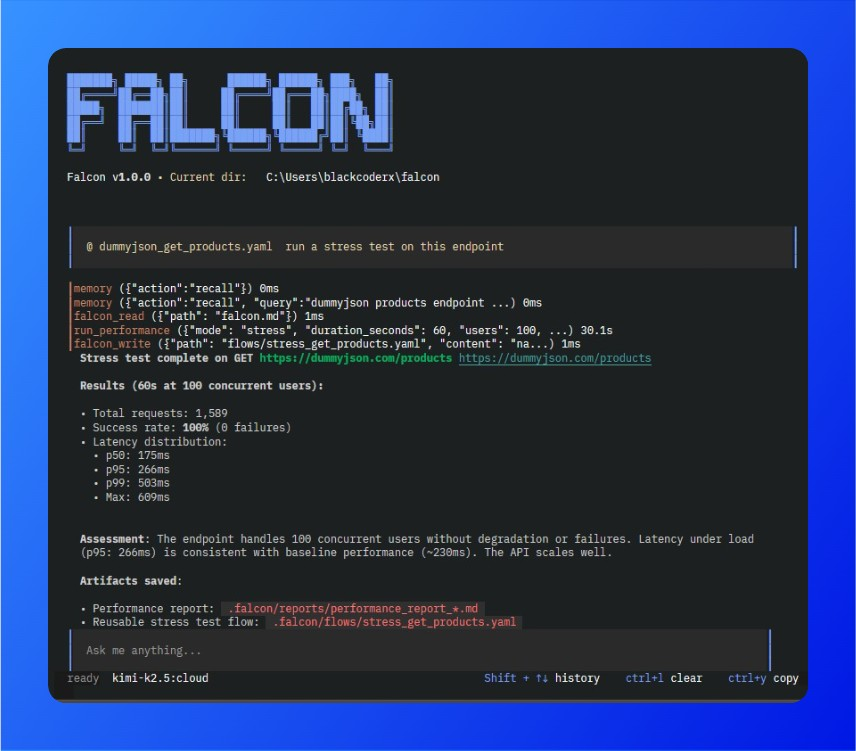

# Falcon

[](https://buymeacoffee.com/blackcoder8)
[](https://go.dev)
[](https://goreportcard.com/report/github.com/blackcoderx/falcon)
[](https://github.com/blackcoderx/falcon/releases/latest)
[](LICENSE)

**Falcon** is a terminal-based AI agent for API developers. It combines API testing, debugging, and code analysis in an interactive TUI powered by a ReAct (Reason+Act) loop. Built in Go with the [Charm](https://charm.sh) ecosystem (Bubble Tea, Lip Gloss, Glamour).


---

## Features

- **ReAct Agent Loop** — Think, act, observe. Falcon reasons through your request and executes tools autonomously until it has a final answer.
- **28+ Specialized Tools** — HTTP requests, JSON Schema validation, test generation, security scanning, performance testing, code analysis, and more.
- **Multiple LLM Backends** — Ollama (local or cloud), Google Gemini, and OpenRouter (gateway to 100+ models).
- **Interactive TUI** — Real-time streaming output, keyboard shortcuts, model/environment switching, confirmation prompts for file writes.
- **Persistent Memory** — The agent recalls project knowledge across sessions.
- **CLI Mode** — Execute saved requests non-interactively for CI pipelines.

---

## Table of Contents

- [Quick Start](#quick-start)
- [Installation](#installation)
- [Configuration](#configuration)
- [Usage](#usage)
- [Tools Reference](#tools-reference)
- [LLM Providers](#llm-providers)
- [Architecture](#architecture)
- [Development](#development)

---

## Quick Start

```bash
# Build
go build -o falcon ./cmd/falcon

# First run — launches the setup wizard
./falcon

# Start testing
./falcon --framework gin
```

On first run, Falcon creates a `.falcon/` folder in the current directory and walks you through LLM provider setup.

---

## Installation

### Homebrew (macOS / Linux)

```bash
brew tap blackcoderx/falcon
brew install falcon
```

### Scoop (Windows)

```powershell
scoop bucket add falcon https://github.com/blackcoderx/scoop-falcon
scoop install falcon
```

### go install

```bash
go install github.com/blackcoderx/falcon/cmd/falcon@latest
```

### Pre-built Binaries

If Homebrew or Scoop isn't an option, download the binary for your platform directly from the [releases page](https://github.com/blackcoderx/falcon/releases/latest):

| Platform | File |
|----------|------|
| macOS (Apple Silicon) | `falcon_Darwin_arm64.tar.gz` |
| macOS (Intel) | `falcon_Darwin_x86_64.tar.gz` |
| Linux (x86_64) | `falcon_Linux_x86_64.tar.gz` |
| Linux (ARM64) | `falcon_Linux_arm64.tar.gz` |
| Windows (x86_64) | `falcon_Windows_x86_64.zip` |

Extract and move the `falcon` binary to a directory on your `PATH`.

### Build from Source

**Prerequisites:** Go 1.21+

```bash
git clone https://github.com/blackcoderx/falcon
cd falcon
go build -o falcon ./cmd/falcon          # Unix/macOS
go build -o falcon.exe ./cmd/falcon      # Windows
```

### Self-Update

```bash
falcon update
```

Falcon fetches the latest release from GitHub and replaces the binary in-place.

---

## Configuration

Falcon uses two config files:

| File | Scope | Purpose |
|------|-------|---------|
| `~/.falcon/config.yaml` | Global | LLM credentials, shared across all projects |
| `.falcon/config.yaml` | Per-project | Framework, overrides |

Run the setup wizard at any time:

```bash
falcon config
```

### Example Global Config

```yaml
default_provider: gemini
theme: dark

providers:
  ollama:
    model: llama3
    config:
      mode: local
      url: http://localhost:11434

  gemini:
    model: gemini-2.5-flash-lite
    config:
      api_key: YOUR_API_KEY

  openrouter:
    model: google/gemini-2.5-flash-lite
    config:
      api_key: sk-or-...
```

### Environment Variables

| Variable | Description |
|----------|-------------|
| `OLLAMA_API_KEY` | Ollama API key (cloud mode) |
| `GEMINI_API_KEY` | Google Gemini API key |
| `OPENROUTER_API_KEY` | OpenRouter API key |

---

## Usage

### Interactive Mode (Default)

```bash
./falcon                        # Start the TUI
./falcon --framework gin        # Specify your API framework
./falcon --no-index             # Skip automatic spec indexing
```

### CLI Mode (Non-interactive)

Execute a saved request and exit — useful for CI:

```bash
./falcon --request get-users --env prod
./falcon -r create-user -e staging
```

### Subcommands

```bash
falcon version    # Print version, commit, build date
falcon config     # Run the setup wizard
falcon update     # Self-update to latest release
```

### Keyboard Shortcuts

| Key | Action |
|-----|--------|
| `Enter` | Send message to agent |
| `Shift+↑ / Shift+↓` | Navigate input history |
| `Ctrl+L` | Clear screen |
| `Ctrl+Y` | Copy last response to clipboard |
| `/model` | Switch LLM provider or model |
| `/env` | Switch environment variable file |
| `/flow <file>` | Load and execute a YAML workflow |
| `Esc` | Stop agent (or quit if idle) |
| `Ctrl+C` | Quit |

### Example Prompts

```
test all endpoints with invalid auth tokens
run a load test against /api/users with 50 concurrent users
find the handler for POST /orders and check for SQL injection
generate functional tests for the spec at openapi.yaml
save a request called get-profile that hits GET /me with bearer auth
compare today's response to the baseline snapshot
```

---

## Tools Reference

Falcon's agent has access to 28+ tools organized by domain.

### HTTP & Assertions

| Tool | Description |
|------|-------------|
| `http_request` | Make GET/POST/PUT/DELETE/PATCH requests with headers, auth, body, `{{VAR}}` substitution |
| `assert_response` | Validate status code, headers, body content, JSONPath expressions, regex, response time |
| `extract_value` | Extract values via JSONPath, headers, or cookies and save as variables |
| `validate_json_schema` | Strict JSON Schema validation (draft-07 and draft-2020-12) |
| `compare_responses` | Diff two responses for regression detection |
| `auth` | Bearer, Basic, OAuth2, API key, and JWT authentication |
| `wait` | Introduce delays for polling or async operations |
| `retry` | Retry a failed tool call with exponential backoff |
| `webhook_listener` | Spawn a temporary HTTP server to catch webhook callbacks |

### Persistence & Variables

| Tool | Description |
|------|-------------|
| `request` | Save, load, list, and delete API requests as YAML templates |
| `environment` | Manage environment variable files (dev, staging, prod) |
| `variable` | Get/set session or global variables |
| `falcon_read` | Read artifacts from the `.falcon/` directory |
| `falcon_write` | Write YAML/JSON/Markdown to `.falcon/` (path-safe) |
| `memory` | Recall and save project knowledge across sessions |
| `session_log` | Start/end session audit logs with searchable history |

### Debugging & Code Analysis

| Tool | Description |
|------|-------------|
| `find_handler` | Locate endpoint handlers in source code (Gin, Echo, FastAPI, Express + generic) |
| `analyze_endpoint` | LLM analysis of endpoint code structure, auth flows, and security risks |
| `analyze_failure` | Root cause analysis of test failures with remediation suggestions |
| `propose_fix` | Generate unified diff patches for bugs |
| `read_file` | Read source files (up to 100 KB) with line numbers |
| `list_files` | List source files by extension |
| `search_code` | Search the codebase with ripgrep (pure-Go fallback included) |
| `write_file` | Write source files — requires user confirmation with diff preview |
| `create_test_file` | Auto-generate test cases for an endpoint |

### Testing

| Tool | Description |
|------|-------------|
| `run_smoke` | Quick health check across all known endpoints |
| `generate_functional_tests` | LLM-driven scenario generation (happy path, negative, boundary) |
| `run_tests` | Execute test scenarios in parallel |
| `run_data_driven` | Bulk testing with CSV/JSON data sources via `{{VAR}}` substitution |
| `verify_idempotency` | Repeat requests and confirm identical responses (no side effects) |
| `check_regression` | Compare current responses against baseline snapshots |
| `run_performance` | Load, stress, spike, and soak tests with p50/p95/p99 latency metrics |
| `scan_security` | OWASP Top 10 checks, input fuzzing, and auth bypass detection |
| `orchestrate_integration` | Chain multi-step requests with resource linking and variable passing |

### Spec & Automation

| Tool | Description |
|------|-------------|
| `ingest_spec` | Parse OpenAPI/Swagger or Postman collections into `.falcon/spec.yaml` |
| `auto_test` | Autonomous loop: ingest → generate → run → analyze → fix |

---

## LLM Providers

Falcon supports pluggable LLM backends. Switch between them at any time with `/model` inside the TUI.

### Supported Providers

| Provider | Models | Notes |
|----------|--------|-------|
| **Ollama** | llama3, mistral, neural-chat, etc. | Local inference or cloud-hosted |
| **Google Gemini** | gemini-2.5-flash-lite, gemini-pro, etc. | Official SDK |
| **OpenRouter** | 100+ models (Claude, GPT-4, Gemini, etc.) | OpenAI-compatible gateway |

### Adding a New Provider

1. Create `pkg/llm/myprovider/myprovider.go` — implement `LLMClient`:
   ```go
   type LLMClient interface {
       Chat(messages []Message) (string, error)
       ChatStream(messages []Message, callback StreamCallback) (string, error)
       CheckConnection() error
       GetModel() string
   }
   ```
2. Create `pkg/llm/myprovider/myprovider_provider.go` — implement `Provider` and register via `init()`.
3. Add a blank import to `pkg/llm/register_providers.go`.

No changes to core code required — the provider appears automatically in the setup wizard.

---

## `.falcon/` Folder Structure

Falcon stores all artifacts in a flat, type-prefixed layout:

```
.falcon/                        # Per-project
├── config.yaml                 # Project config
├── falcon.md                   # API knowledge base (written by agent)
├── spec.yaml                   # Ingested API spec
├── manifest.json               # Endpoint graph
├── variables.json              # Global variables
├── environments/
│   ├── dev.yaml
│   └── prod.yaml
├── requests/
│   ├── get-users.yaml
│   └── create-user.yaml
├── sessions/
│   └── session_<timestamp>.json
├── baselines/
│   └── baseline_users_api.json
├── flows/
│   ├── unit_get_users.yaml
│   └── integration_login_create_delete.yaml
└── reports/
    ├── performance_report_users_api_20260227.md
    └── security_report_auth_api_20260227.md

~/.falcon/                      # Global (across all projects)
├── config.yaml
└── memory.json
```

**Naming conventions:**
- Reports: `<type>_report_<api-name>_<timestamp>.md`
- Flows: `<type>_<description>.yaml`

---

## Architecture

```
cmd/falcon/
└── main.go              ← Cobra CLI, .env loading, TUI launch

pkg/core/
├── agent.go             ← Agent struct, tool registry, mutex-guarded state
├── react.go             ← ReAct loop (think → act → observe, 3× retry)
├── types.go             ← Tool & AgentEvent interfaces
├── memory.go            ← Persistent memory store
├── analysis.go          ← Stack trace parsing
├── prompt/              ← Modular system prompt builder
└── tools/               ← 28+ tools by domain

pkg/llm/
├── client.go            ← LLMClient interface
├── registry.go          ← Self-registering provider registry
├── ollama/              ← Ollama provider
├── gemini/              ← Google Gemini provider
└── openrouter/          ← OpenRouter provider

pkg/tui/
├── app.go               ← Entry point
├── model.go             ← UI state
├── update.go            ← Event handling (Elm architecture)
├── view.go              ← Layout rendering
└── styles.go            ← Lip Gloss styling

pkg/storage/             ← YAML/env file I/O, variable substitution
```

### ReAct Loop

```
User input
   ↓
Build system prompt (tool descriptions + memory)
   ↓
LLM streaming call (retry up to 3× with backoff)
   ↓
Parse response
   ├── ACTION: tool_name({...})  →  Execute tool  →  Append observation  →  Loop
   └── Final Answer: ...         →  Return to user
```

### Tool Interface

```go
type Tool interface {
    Name() string           // snake_case identifier
    Description() string    // Included in system prompt
    Parameters() string     // JSON Schema
    Execute(args string) (string, error)
}
```

### Agent Events (streamed to TUI in real-time)

| Event | Description |
|-------|-------------|
| `streaming` | Partial LLM response chunk |
| `tool_call` | Tool invocation with arguments |
| `observation` | Tool result |
| `answer` | Final answer (rendered as Glamour markdown) |
| `error` | Error (shown in red) |
| `confirmation_required` | File write awaiting Y/N approval |

---

## Development

### Commands

```bash
# Build
go build -o falcon ./cmd/falcon

# Test
go test ./...                             # All tests
go test ./pkg/core/...                    # Core package
go test -v -run TestName ./pkg/core/...   # Single test
go test -cover ./...                      # With coverage

# Format
go fmt ./...
```

### Adding a New Tool

1. Create `pkg/core/tools/<module>/tool.go` and implement the `Tool` interface.
2. Register it in `pkg/core/tools/registry.go` within the appropriate `register*()` function.
3. Update the system prompt reference in `pkg/core/prompt/tools.go`.

If the tool writes reports, call `shared.ValidateReportContent()` before returning.

If the tool writes files, implement `ConfirmableTool` to hook into the TUI confirmation workflow.


---

## Dependencies

| Library | Purpose |
|---------|---------|
| `charmbracelet/bubbletea` | TUI framework (Elm architecture) |
| `charmbracelet/lipgloss` | Terminal styling |
| `charmbracelet/glamour` | Markdown rendering |
| `charmbracelet/huh` | Interactive forms (setup wizard) |
| `spf13/cobra` | CLI framework |
| `spf13/viper` | Config management |
| `pb33f/libopenapi` | OpenAPI spec parsing |
| `rbretecher/go-postman-collection` | Postman collection parsing |
| `google.golang.org/genai` | Google Gemini SDK |
| `xeipuuv/gojsonschema` | JSON Schema validation |
| `joho/godotenv` | `.env` file loading |
| `rhysd/go-github-selfupdate` | Auto-update mechanism |

---

## License

See [LICENSE](LICENSE).
