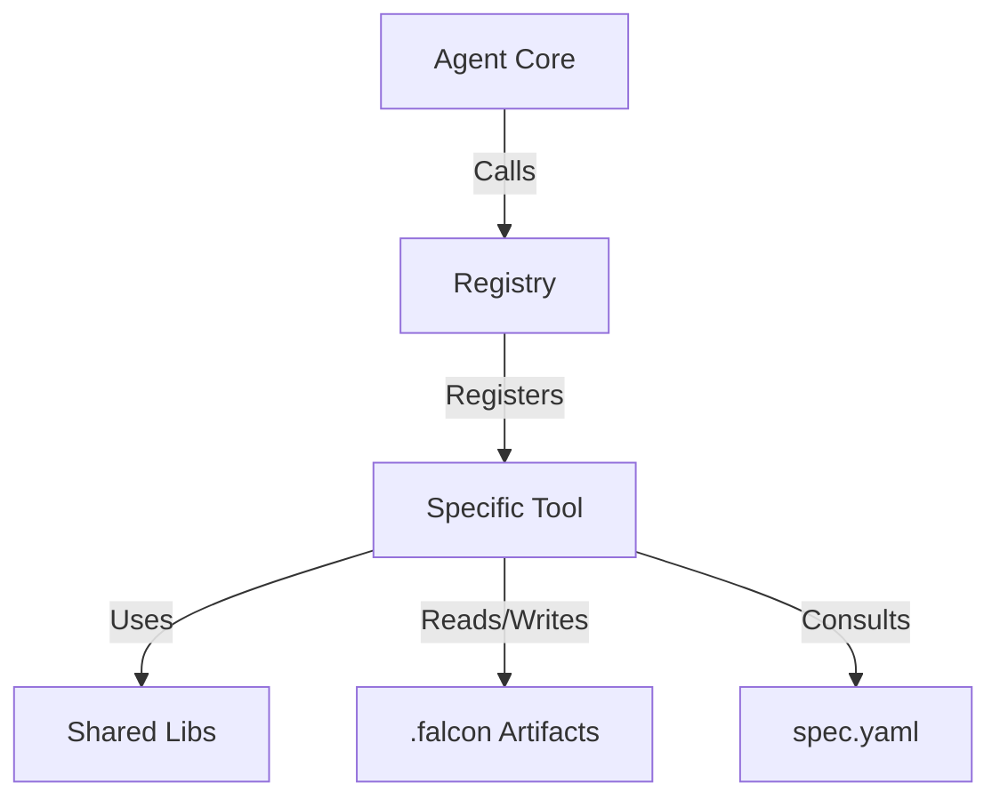

# Falcon Tools Architecture (`pkg/core/tools`)

This directory contains the 28-tool set for Falcon, the autonomous API testing agent. The architecture is modular, with tools organized into functional domains that support 8 testing types: Unit, Integration, Smoke, Functional, Contract, Performance, Security, and E2E.

## Architecture Overview

Falcon's tool system is built on three core components:

1. **The Registry** (`registry.go`): The central hub that instantiates and registers all 28 tools with the agent.
2. **Shared Libraries** (`shared/`): Common utilities for HTTP, Authentication, Assertions, Variable Substitution, and .falcon artifact management used by most tools.
3. **Domain Modules**: Standalone packages (e.g., `security_scanner`, `performance_engine`) that encapsulate specific testing logic.

### Interaction Flow



## The 28 Tools (Organized by Testing Type)

### Core (5 tools)
Essential for every interaction:
- **`http_request`** (`shared`): Execute HTTP requests with auth headers, body, and validation
- **`variable`** (`persistence`): Get/set variables (session-scoped and global-scoped)
- **`auth`** (`shared`): Unified authentication — bearer, basic, OAuth2, JWT parsing
- **`wait`** (`shared`): Delay between requests (backoff, polling)
- **`retry`** (`shared`): Retry failed tool calls with exponential backoff

### Persistence (6 tools)
Manage requests, environments, and .falcon artifacts:
- **`request`** (`persistence`): Save/load/list API requests (replaces save_request, load_request, list_requests)
- **`environment`** (`persistence`): Set/list environment variables (replaces set_environment, list_environments)
- **`falcon_write`** (`shared`): Write validated YAML/JSON/Markdown to .falcon/ (with path safety)
- **`falcon_read`** (`shared`): Read artifacts from .falcon/ (reports, flows, specs)
- **`memory`** (`agent`): Recall facts, save discoveries, update the falcon.md knowledge base
- **`session_log`** (`shared`): Start/end session audit log, list/read past sessions

### Spec (1 tool)
API specification ingestion:
- **`ingest_spec`** (`spec_ingester`): Parse OpenAPI/Postman specs into `.falcon/spec.yaml`

### Unit Testing (3 tools)
Test individual endpoints:
- **`assert_response`** (`shared`): Validate HTTP status, body content, JSON paths
- **`extract_value`** (`shared`): Extract values from responses (for chaining)
- **`validate_json_schema`** (`shared`): Strict schema validation against spec

### Integration (1 tool)
Test multi-step workflows:
- **`orchestrate_integration`** (`integration_orchestrator`): Chain multiple requests in a single transaction

### Smoke (1 tool)
Fast health checks:
- **`run_smoke`** (`smoke_runner`): Hit all endpoints once to verify the API is up

### Functional (3 tools)
Test happy path, negative cases, edge cases:
- **`generate_functional_tests`** (`functional_test_generator`): Generate test scenarios from spec using LLM
- **`run_tests`** (`agent`): Execute test scenarios; can run all or a single scenario (replaces run_single_test)
- **`run_data_driven`** (`data_driven_engine`): Bulk testing with CSV/JSON data

### Contract (3 tools)
Verify spec compliance and stability:
- **`verify_idempotency`** (`idempotency_verifier`): Confirm requests have no side effects
- **`compare_responses`** (`regression_watchdog`): Compare two responses for differences
- **`check_regression`** (`regression_watchdog`): Compare against baseline snapshots

### Performance (2 tools)
Load testing and resilience:
- **`run_performance`** (`performance_engine`): Load/stress/spike/soak testing (replaces performance_test)
- **`webhook_listener`** (`performance_engine`): Capture webhooks during async tests

### Security (1 tool)
OWASP and auth auditing:
- **`scan_security`** (`security_scanner`): OWASP/fuzzing/auth bypass checks

### Debugging (7 tools)
Code analysis and fixes:
- **`find_handler`** (`debugging`): Search codebase for endpoint handler
- **`analyze_endpoint`** (`debugging`): Analyze endpoint code
- **`analyze_failure`** (`debugging`): Explain why a test failed
- **`propose_fix`** (`debugging`): Generate code patch
- **`read_file`** (`debugging`): Read source files
- **`search_code`** (`debugging`): Search codebase with regex
- **`write_file`** (`debugging`): Write to source files

### Orchestration (2 tools)
Advanced multi-test management:
- **`auto_test`** (`agent`): Autonomous testing loop (spec → generate → run → fix)
- **`test_suite`** (`agent`): Bundle multiple flows into a named suite

---

## Module Organization

### Foundation (`shared/`, `persistence/`, `agent/`)
The bedrock of Falcon:
- **`shared`**: HTTP client, unified auth, assertions, variable substitution, .falcon writers, session log
- **`persistence`**: Request/environment storage, variable scope management
- **`agent`**: Memory, auto-testing, test execution, session management

### Specification (`spec_ingester/`)
Parses OpenAPI/Postman specs into `.falcon/spec.yaml` (YAML, human-readable). The spec is the "source of truth" for endpoints.

### Test Generation & Execution (`functional_test_generator/`, `data_driven_engine/`, `smoke_runner/`)
- **`functional_test_generator`**: LLM-driven test generation with strategies (Happy/Negative/Boundary)
- **`smoke_runner`**: Minimal, fast health checks
- **`data_driven_engine`**: Bulk runs with external data

### Specialized Engines (`security_scanner/`, `performance_engine/`)
- **`security_scanner`**: OWASP auditing, input fuzzing, auth bypass checks
- **`performance_engine`**: Load/stress/spike/soak testing with metrics

### Verification (`idempotency_verifier/`, `regression_watchdog/`)
- **`idempotency_verifier`**: Confirms requests can safely be retried
- **`regression_watchdog`**: Baseline snapshots and comparison

### Debugging (`debugging/`)
Root cause analysis and code fixes.

### Integration (`integration_orchestrator/`)
Multi-step workflows and resource chaining.

---

## .falcon Folder Structure (Flat)

All artifacts use a flat structure — no subdirectories in `reports/` or `flows/`. Filenames carry context via type prefix:

```
.falcon/
├── config.yaml              # LLM provider, model, framework, tool limits
├── manifest.json            # Workspace manifest (counts)
├── memory.json              # Persistent agent memory
├── falcon.md                # API knowledge base (validated on write)
├── spec.yaml                # Ingested API spec (YAML, single file)
├── variables.json           # Global variables
├── sessions/
│   ├── session_2026-02-27T14:32:01Z.json
│   └── session_2026-02-27T15:45:22Z.json
├── environments/
│   ├── dev.yaml
│   ├── prod.yaml
│   └── staging.yaml
├── requests/
│   ├── create_user.yaml
│   └── get_users.yaml
├── baselines/
│   ├── baseline_users_api.json
│   └── baseline_products_api.json
├── flows/
│   ├── unit_get_users.yaml
│   ├── integration_login_create_delete.yaml
│   ├── smoke_all_endpoints.yaml
│   └── security_auth_bypass.yaml
└── reports/
    ├── performance_report_dummyjson_products_20260227.md
    ├── security_report_products_api_20260227.md
    ├── functional_report_users_api_20260227.md
    └── unit_report_get_users_20260227.md
```

### File Naming Conventions

**Reports** (type prefix indicates testing type):
```
<type>_report_<api-name>_<timestamp>.md
```
Examples: `performance_report_dummyjson_products.md`, `security_report_auth_api.md`

**Flows** (type + description):
```
<type>_<description>.yaml
```
Examples: `unit_get_users.yaml`, `integration_login_flow.yaml`, `security_auth_bypass.yaml`

**Spec** (single YAML file):
```
spec.yaml
```

---

## Tool Validation & Safety

### Report Validation
After writing any report, `ValidateReportContent()` checks:
1. File exists and is > 64 bytes
2. Contains at least one Markdown heading (`# ` or `## `)
3. Contains at least one result indicator (table `|`, code block ` ``` `, or status keyword like `PASS`, `FAIL`, `✓`, `✗`)
4. Does not contain unresolved placeholders (`{{`, `TODO`, `[placeholder]`)

If validation fails, the tool returns an error so the agent can retry.

### falcon.md Validation
After `update_knowledge` writes to `falcon.md`, `ValidateFalconMD()` checks:
1. File exists and is > 200 bytes
2. Contains required sections: `# Base URLs`, `# Known Endpoints`
3. Each section has at least one non-blank line of content

### falcon_write Safety
The `falcon_write` tool enforces strict path safety:
1. Blocks `../` (no directory traversal)
2. Blocks absolute paths
3. Blocks writes to protected files (`config.yaml`, `manifest.json`, `memory.json`)
4. Validates YAML/JSON syntax before writing

---


## Extending Falcon

To add a new tool:

1. **Create Module**: `pkg/core/tools/<new_module>/` with your implementation
2. **Implement Interface**: Match the `core.Tool` interface
3. **Register**: Add to `registerAllTools()` in `registry.go`
4. **Validate**: If writing reports, call `ValidateReportContent()` after writing
5. **Document**: Add a `README.md` in the module and update this file

### Tool Interface

```go
type Tool interface {
    Name() string                        // Unique identifier
    Description() string                 // Human-readable for LLM
    Parameters() string                  // JSON Schema
    Execute(args string) (string, error) // Main logic
}
```

---

## Quick Reference: Which Tool for Which Task?

| Task | Tool | Notes |
|------|------|-------|
| Hit an endpoint | `http_request` | Core tool for all API calls |
| Check response | `assert_response` | Validate status, body, JSON paths |
| Extract value | `extract_value` | Pull a value for chaining |
| Test all endpoints fast | `run_smoke` | Health check; minimal |
| Generate tests | `generate_functional_tests` | LLM-driven; happy/negative/boundary |
| Run tests | `run_tests` | Execute scenarios from spec |
| Load test | `run_performance` | Load/stress/spike/soak modes |
| Security audit | `scan_security` | OWASP, fuzzing, auth bypass |
| Save a request | `request(action=save)` | For reuse |
| Load request | `request(action=load)` | Reuse saved request |
| Set env vars | `environment(action=set)` | Global or per-scenario |
| Authenticate | `auth(action=bearer)` | Bearer, Basic, OAuth2 |
| Find code | `find_handler` | Search codebase |
| Explain failure | `analyze_failure` | Root cause analysis |
| Fix code | `propose_fix` | Generate patch |
| Chain requests | `orchestrate_integration` | Multi-step workflow |
| Save artifact | `falcon_write` | Write to .falcon/ |
| Read artifact | `falcon_read` | Read from .falcon/ |
| Recall knowledge | `memory(action=recall)` | Hydrate from .falcon/memory.json |
| Save discovery | `memory(action=save)` | Persistent learning |
| Log session | `session_log(action=start)` | Audit trail |

---

## For More Details

- **Core Agent Logic**: See `pkg/core/README.md`
- **Individual Tool Module READMEs**: Each `pkg/core/tools/<module>/README.md` has tool-specific docs
- **System Prompt**: `pkg/core/prompt/workflow.go` and `tools.go` define Falcon's behavior
