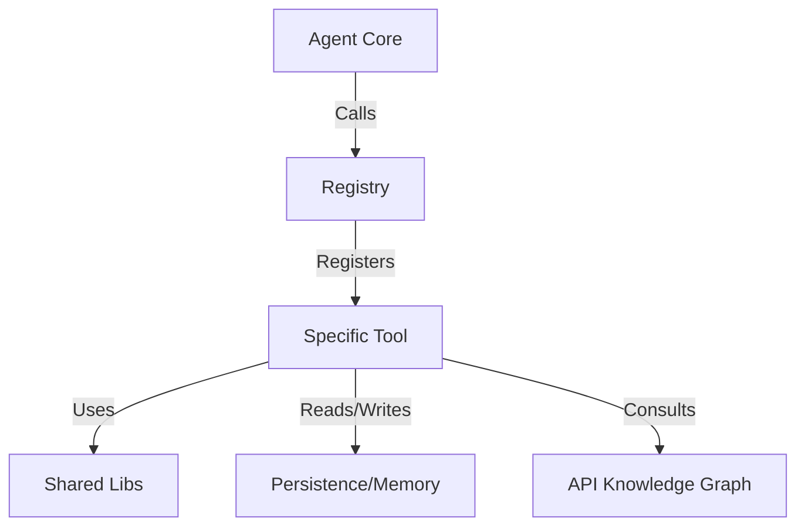

# ZAP Tools Architecture (`pkg/core/tools`)

This directory contains the complete toolset for the ZAP autonomous agent. The architecture is modular, with tools organized into functional domains (tiers) that build upon each other.

For a detailed mapping to the ZAP Blueprint, see [OVERVIEW.md](./OVERVIEW.md).

## Architecture Overview

ZAP's tool system relies on three core components:

1.  **The Registry** (`registry.go`): The central hub that instantiates and registers all tools with the agent.
2.  **Shared Libraries** (`shared/`): Common utilities for HTTP, Authentication, Assertions, and Variable Substitution used by almost every tool.
3.  **Domain Modules**: Standalone packages (e.g., `security_scanner`, `performance_engine`) that encapsulate specific testing logic.

### Interaction Flow

## Module Deep Dive

### 1. Foundation (`shared/`, `persistence/`, `agent/`)
**Purpose**: The bedrock of ZAP. Handles all IO, state, and decision making.

-   **`shared`**: Contains `HTTPTool` (the http client), `AuthTool` (token management), and `AssertTool` (validation logic). *Every* test engine uses these to ensure consistent behavior.
-   **`persistence`**: Manages the filesystem state—saving requests (`save_request`), loading environments (`set_environment`), and handling global variables (`variable`).
-   **`agent`**: Tools the agent uses to manage *itself*. `memory` allows it to recall facts across sessions, and `export_results` generates reports.

### 2. Discovery & Analysis (`spec_ingester/`, `dependency_mapper/`)
**Purpose**: Understanding the target API before testing begins.

-   **`spec_ingester`**: The entry point. Parses OpenAPI/Postman files and builds the **API Knowledge Graph**. This graph is the "brain" that other tools query to know what endpoints exist.
-   **`dependency_mapper`**: Analyzes the graph to find relationships (e.g., "Endpoint A creates a resource needed by Endpoint B").

### 3. Test Generation & Execution (`functional_test_generator/`, `data_driven_engine/`, `smoke_runner/`)
**Purpose**: Creating and running tests.

-   **`functional_test_generator`**: The creative engine. Uses LLMs and strategies (Happy/Negative/Boundary) to generate `TestScenario` objects from the graph.
-   **`smoke_runner`**: Speed-focused. Runs a minimal set of health checks to fail fast if the API is down.
-   **`data_driven_engine`**: Volume-focused. Takes a scenario and runs it 1000s of times with data from CSV/JSON files.

### 4. Specialized Engines (`security_scanner/`, `performance_engine/`)
**Purpose**: Deep-dive testing for specific non-functional requirements.

-   **`security_scanner`**: A specialized auditor. checks for OWASP vulnerabilities, fuzzes inputs, and audits auth logic.
-   **`performance_engine`**: Simulates load. Can run in `load`, `stress`, `spike`, or `soak` modes to test system resilience.

### 5. Verification & Governance (`validators...`)
**Purpose**: Ensuring long-term stability and correctness.

-   **`api_drift_analyzer`**: Compares Live API vs Spec.
-   **`breaking_change_detector`**: Compares Spec v1 vs Spec v2.
-   **`schema_conformance`**: Strictly validates every response against the schema.
-   **`regression_watchdog`**: Compares visual/data snapshots over time.
-   **`idempotency_verifier`**: Checks for side-effect safety.
-   **`documentation_validator`**: Checks READMEs vs Implementation.

### 6. Debugging & Remediation (`debugging/`, `unit_test_scaffolder/`)
**Purpose**: Fixing problems when they are found.

-   **`debugging`**: The detective. `analyze_failure` explains *why* a test failed. `find_handler` locates the code. `propose_fix` generates the patch.
-   **`unit_test_scaffolder`**: The builder. Generates unit tests to prevent future regressions.

## Tool Reference

| Tool Name | Module | Description |
|-----------|--------|-------------|
| `http_request` | `shared` | Execute HTTP requests |
| `save_request` | `persistence` | Save request to YAML |
| `variable` | `persistence` | Manage variables |
| `ingest_spec` | `spec_ingester` | Parse API specs |
| `map_dependencies` | `dependency_mapper` | Find resource links |
| `generate_functional_tests` | `functional_test_generator` | Create test scenarios |
| `run_smoke` | `smoke_runner` | Fast health check |
| `run_data_driven` | `data_driven_engine` | Bulk testing |
| `scan_security` | `security_scanner` | OWASP/Auth audit |
| `run_performance` | `performance_engine` | Load/Stress testing |
| `analyze_drift` | `api_drift_analyzer` | Live vs Spec check |
| `detect_breaking_changes` | `breaking_change_detector` | Spec vs Spec check |
| `verify_schema_conformance` | `schema_conformance` | Strict schema validation |
| `check_regression` | `regression_watchdog` | Baseline comparison |
| `verify_idempotency` | `idempotency_verifier` | Side-effect check |
| `validate_docs` | `documentation_validator` | Doc vs Implementation |
| `analyze_failure` | `debugging` | Explain failure causes |
| `find_handler` | `debugging` | Locate source code |
| `propose_fix` | `debugging` | Generate code fix |
| `scaffold_unit_tests` | `unit_test_scaffolder` | Generate unit tests |
| `orchestrate_integration` | `integration_orchestrator` | Multi-step workflows |
| `auto_test` | `agent` | Autonomous testing loop |
| `memory` | `agent` | Agent knowledge base |

## Extending ZAP

To add a new capability:

1.  **Create Module**: implementation in `pkg/core/tools/<new_module>/`.
2.  ** Implement Interface**: Match the `core.Tool` interface.
3.  **Register**: Add to `RegisterAllTools` in `pkg/core/tools/registry.go`.
4.  **Document**: Add a `README.md` and update this file.
